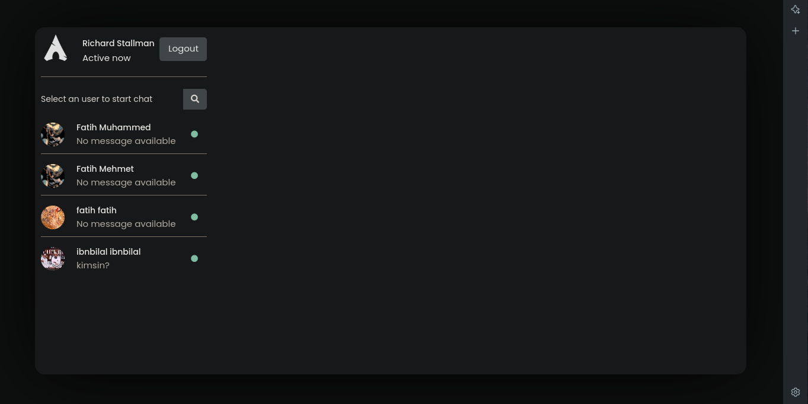
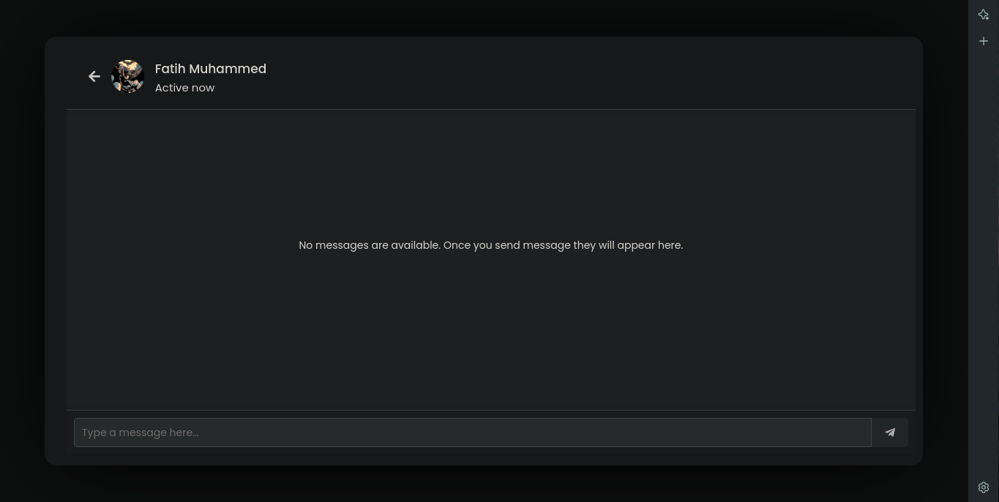

# Chat App PHP

**Demo preview link: [https://whatshapp.rf.gd/](https://whatshapp.rf.gd)**

This Chat App also has an Admin panel, but to get to it you need to use the URL bar at the top of your browser and add the following to the end of localhost: /adminpanel/adminpanel.php

There is something I want to add as a note, if it gives an error on the login screen, it is probably a permission error. You can solve it like this:

sudo chown -R your_username:your_username ChatAppLocation/*

sudo chmod -R 755 ChatAppLocation/*

For example:

sudo chown -R trluser:trluser /var/www/html/*

sudo chmod -R 755 /var/www/html/*
